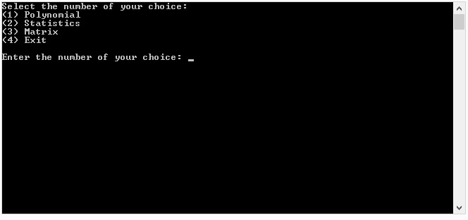
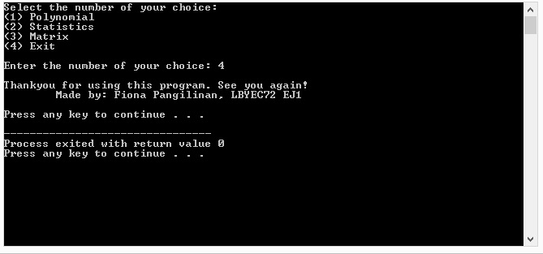
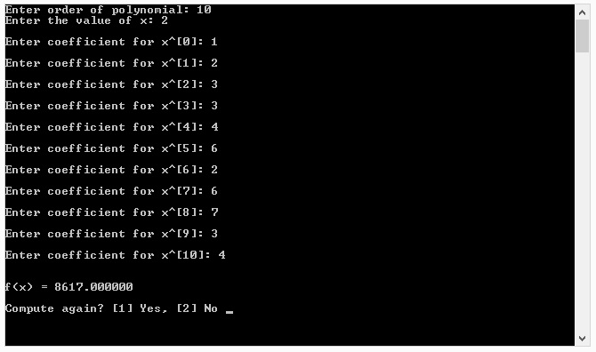
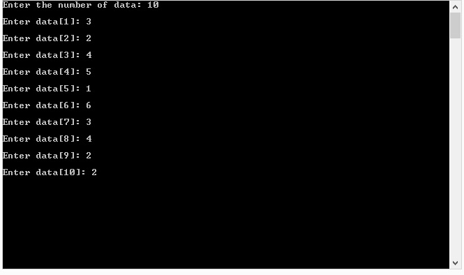

# lbyec72-ej1-p3-single_multidimensional_arrays-fionapangilinan
lbyec72-ej1-p3-single_multidimensional_arrays-fionapangilinan created by GitHub Classroom

screenshots:

The main selection screen

when 4 was selected:

when 1 was selected:

when Yes was selected it computes again:

when No was selected it goes back to the main menu:

when 2 wass selected:

