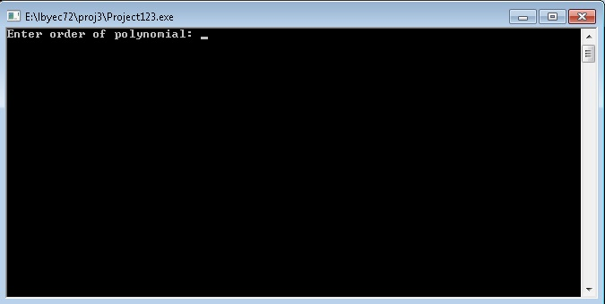
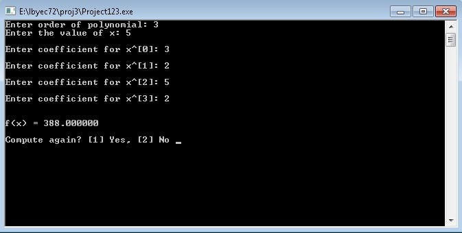
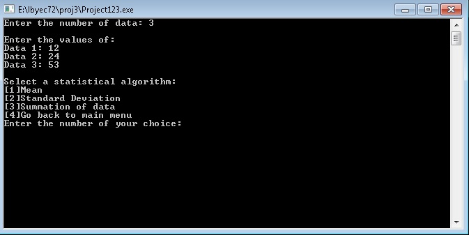
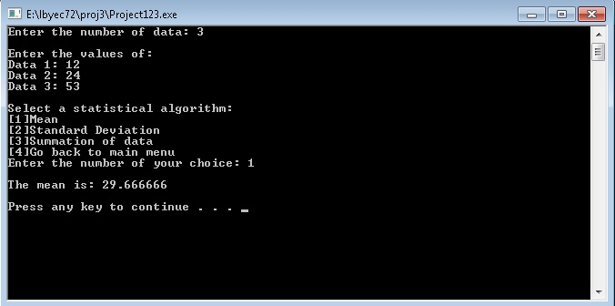
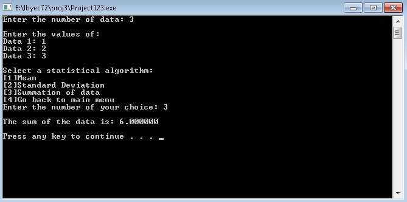
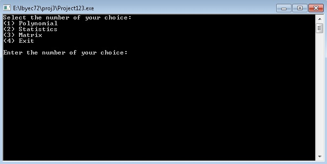
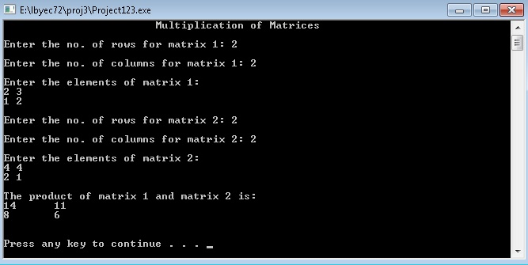

# lbyec72-ej1-p3-single_multidimensional_arrays-fionapangilinan
lbyec72-ej1-p3-single_multidimensional_arrays-fionapangilinan created by GitHub Classroom

screenshots:

The main selection screen

(1)Polynomial is selected. Program asks user the order of the polynomial.

Asks for the values for x and the coefficients and enters them. Displays the answer.

Goes back to the main menu.

(2)Statistics is selected. Program asks for number of data and their corresponding values, and then asks for which operation to  perform.

Selecting the mean.

Selecting the standard deviation.

Selecting the summation of data.

Goes back to the main menu (every after operation done in statistics part)

(3)Matrix is selected. Another selection screen: Addition, Multiplication and Transpose.

Addition of Matrices

Multiplication of Matrices

Transpose of Matrix

(4)Exit is selected. Exits the program.

